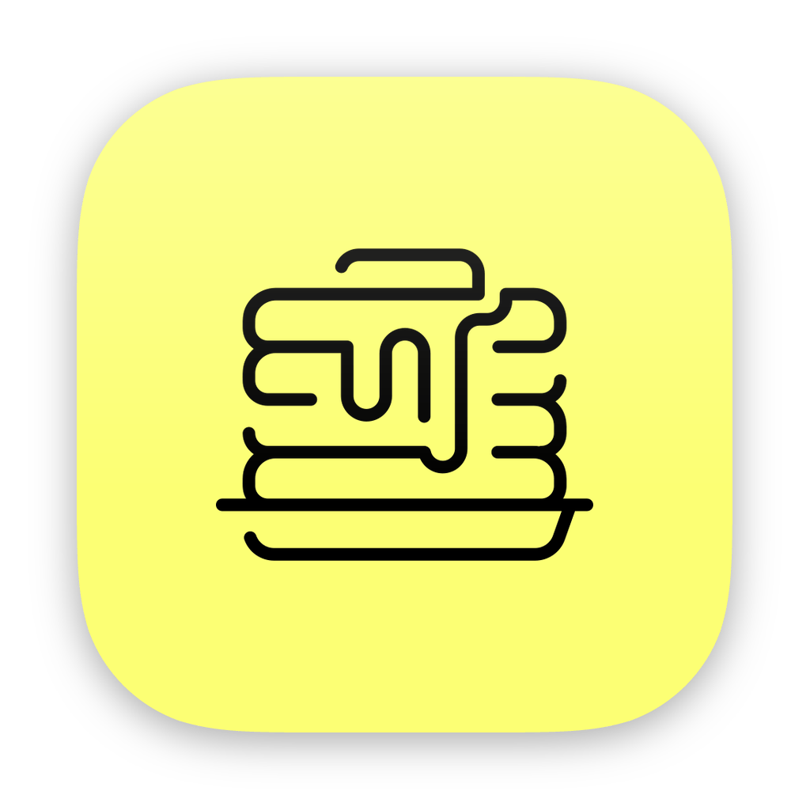
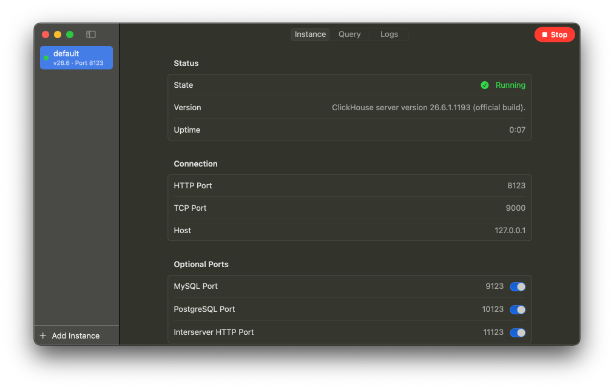

# International Clicks

A native macOS app for running local ClickHouse instances, inspired by Postgres.app and built with [strudel](https://github.com/octavore/strudel).

## Features

<p align="center">
  
</p>

- Run multiple versions/instances
- Query ClickHouse directly
- Menu bar app
- Uses official ClickHouse macOS binaries from `builds.clickhouse.com`


## Developing

You will need [strudel](https://github.com/octavore/strudel) and Xcode.

```
strudel build [--unsigned]  # build the app
strudel build --install     # build and install to /Applications
strudel run                 # build and launch
```

## License

MIT

ClickHouse is a registered trademark of [ClickHouse, Inc](https://clickhouse.com).